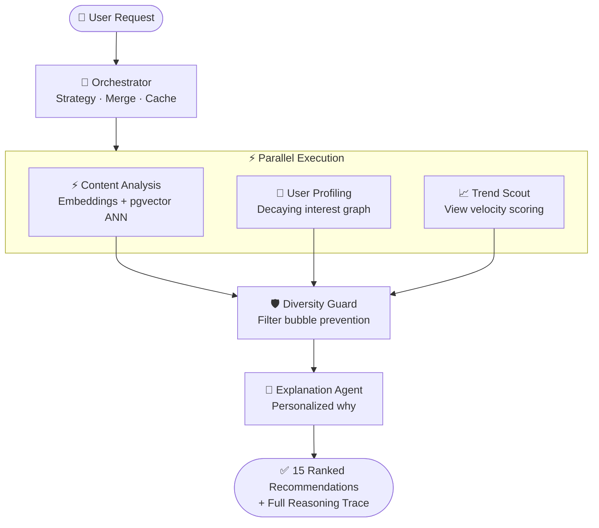
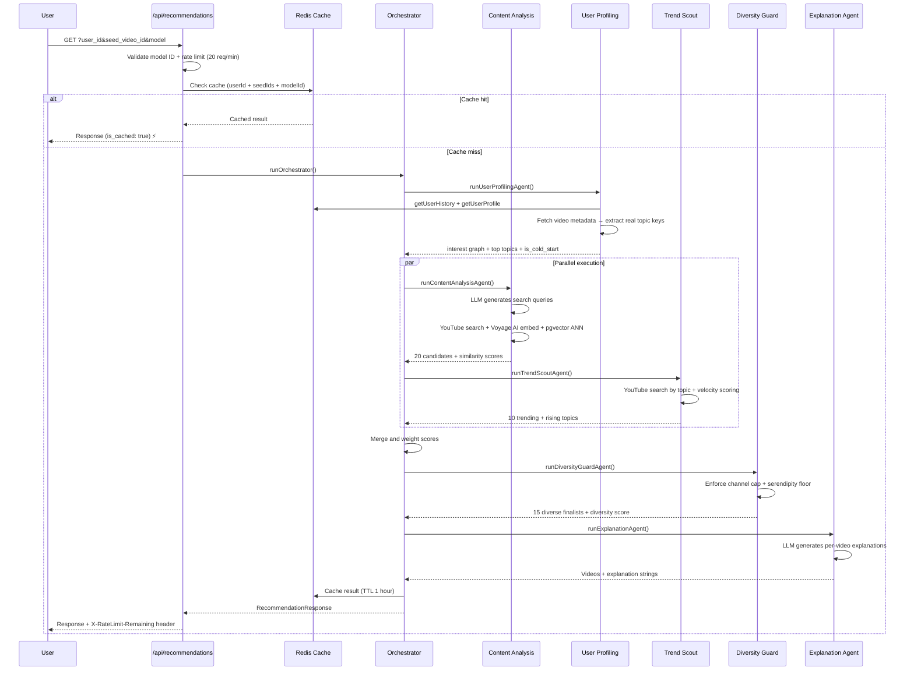
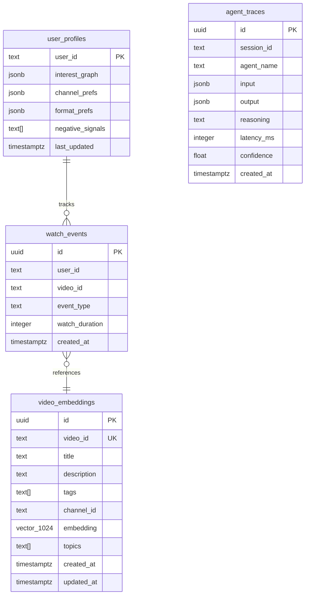

# SERENDEX
### Serendipitous Discovery Engine — Agentic YouTube Recommendation System

> *"The best recommendation is the one you didn't know you needed."*

---

## Codename: SERENDEX

**S**emantics · **E**mbeddings · **R**easoning · **E**ngagement · **N**eural · **D**iscovery · **EX**ploration

Unique, not taken, hints at *serendipity* (unexpected discovery) + *index* (search/ranking). That's exactly what great recommendations feel like.

---

## Table of Contents

1. [Vision](#1-vision)
2. [Problem Statement](#2-problem-statement)
3. [Agentic Architecture](#3-agentic-architecture)
4. [Agent Specifications](#4-agent-specifications)
5. [Data Flow](#5-data-flow)
6. [Tech Stack](#6-tech-stack)
7. [API Design](#7-api-design)
8. [Database Schema](#8-database-schema)
9. [Frontend Design](#9-frontend-design)
10. [Deployment Architecture](#10-deployment-architecture)
11. [Interview Explainability Guide](#11-interview-explainability-guide)
12. [Build Roadmap](#12-build-roadmap)

---

## 1. Vision

SERENDEX is a **multi-agent AI system** that recommends YouTube videos the way a brilliant friend would — not just "similar to what you watched" but *reasoning about who you are, what you're missing, and what's culturally relevant right now.*

Unlike traditional recommendation pipelines (static models, batch updates), SERENDEX is a **living society of agents** that collaborate, debate, and self-correct in real time.

---

## 2. Problem Statement

| Problem | Traditional System | SERENDEX Approach |
|---|---|---|
| Cold start | Fails for new users | Orchestrator routes to Trend Scout first |
| Filter bubbles | Amplifies existing interests | Diversity Guard audits every result set |
| Staleness | Batch retraining (hours/days) | Trend Scout polls in near real-time |
| Black box | No explanation possible | Explanation Agent narrates every decision |
| Single failure point | One model fails = bad results | Agents degrade gracefully with fallbacks |

---

## 3. Agentic Architecture



### Agent Table

| Agent | Model | Role |
|---|---|---|
| Orchestrator | Configurable (default: `gpt-4o-mini`) | Reasons about strategy, delegates, merges results, caches |
| Content Analysis | Configurable (default: `gpt-4o-mini`) | Semantic similarity via YouTube API + pgvector |
| User Profiling | — (algorithmic) | Decaying interest graph from real video metadata + Redis |
| Trend Scout | — (algorithmic) | Rising topics, view velocity scoring |
| Diversity Guard | — (algorithmic) | Enforces channel/topic diversity constraints |
| Explanation Agent | Configurable (default: `gpt-4o-mini`) | Personalized natural language "why this was recommended" |

### Agent Interaction Principles

1. **Parallel by default** — Content Analysis and Trend Scout run concurrently via `Promise.all`
2. **Sequential where dependent** — Diversity Guard and Explanation Agent run only after all three parallel agents complete
3. **Cold start routing** — Orchestrator detects new users (< 3 watch events) and shifts weights: content 0.6 / trend 0.3 / profiling 0.1
4. **Full result caching** — Orchestrator caches the complete response in Redis for 1 hour, keyed by `userId + seedVideoIds + modelId + query`

---

## 4. Agent Specifications

### 4.1 Orchestrator Agent

**Role:** The brain. Coordinates all agents, reasons about user context, decides the optimal weighting strategy, merges results.

**Model:** Configurable at runtime via `?model=` query param (default: `gpt-4o-mini`)

**Merge weights:**
```
Cold start user (< 3 events):
  final_score = content_similarity × 0.6 + user_relevance × 0.1 + trend_score × 0.3

Returning user:
  final_score = content_similarity × 0.5 + user_relevance × 0.3 + trend_score × 0.2
```

---

### 4.2 Content Analysis Agent

**Role:** Understands the semantic meaning of videos. Finds what's *like* something, not just what's tagged the same.

**Model:** Configurable (default: `gpt-4o-mini`)

**Tools available:**
- `search_youtube(query, max_results)` — YouTube Data API v3
- `get_video_details(video_ids[])` — title, description, tags, duration, channel
- `embed_texts(texts[])` — Voyage AI `voyage-2` → 1024-dim vectors
- `vector_search(embedding, top_k)` — cosine similarity search in pgvector

**Algorithm:**
1. LLM generates 2–3 targeted search queries from seed videos + user topics
2. Executes searches, deduplicates candidates
3. Embeds all candidate video texts → 1024-dim vectors via Voyage AI
4. Computes cosine similarity against seed video embeddings
5. Persists new embeddings to pgvector for future searches
6. Also queries pgvector ANN index for historically similar videos
7. Returns top-20 scored candidates

---

### 4.3 User Profiling Agent

**Role:** Builds and maintains a dynamic interest graph using real video metadata — not opaque video ID proxies.

**Model:** None — fully algorithmic

**Data sources:**
- `getUserHistory(userId, 20)` — last 20 watch/click events from Redis
- `getUserProfile(userId)` — persisted interest graph
- `getVideoDetails(videoIds[])` — fetches real video metadata to extract meaningful topic keys

**Topic extraction:**
```
video.tags = ["AI", "Machine Learning", "Neural Networks"]
→ interest_graph["ai"] += weight / topics.length
→ interest_graph["machine_learning"] += weight / topics.length
→ interest_graph["neural_networks"] += weight / topics.length
```

**Interest decay (applied each run):**
```
weight = weight × 0.95
(weights below 0.01 are pruned)
```

**Event weights:**

| Event | Weight |
|---|---|
| like | 1.0 |
| watch | min(duration_seconds / 300, 0.8) |
| click | 0.3 |
| skip | −0.2 |
| dislike | −0.5 |

---

### 4.4 Trend Scout Agent

**Role:** Finds what's *rising* before it peaks. Injects cultural freshness into recommendations.

**Model:** None — fully algorithmic

**Trend scoring:**
```
trend_score = min((view_count / 1_000_000) × recency_boost, 1)
recency_boost = 1 + (1 / days_since_publish)
```

If topic hints exist, searches `{topic} {currentYear} news`. Falls back to YouTube global trending when no context is available.

---

### 4.5 Diversity Guard Agent

**Role:** Acts as a critic. Enforces hard diversity constraints on the merged candidate list.

**Model:** None — fully algorithmic

**Constraints:**
```
max_same_channel:        2     // no channel monopoly
min_new_territory_ratio: 0.15  // 15% serendipitous picks
target_count:            15    // final list size
```

**Diversity score:**
```
list_diversity = channel_diversity × 0.6 + explanation_type_diversity × 0.4
```

---

### 4.6 Explanation Agent

**Role:** Makes SERENDEX trustworthy and transparent. Generates a human-readable "why" for each recommendation.

**Model:** Configurable (default: `gpt-4o-mini`)

**Explanation types:**
- `content_match` — semantically similar to seed videos
- `interest_evolution` — extends a known interest into new territory
- `trending` — rising fast in topics you care about
- `serendipitous` — outside usual topics but algorithmically novel
- `social_proof` — popular among viewers with similar taste

---

## 5. Data Flow



---

## 6. Tech Stack

### Runtime
| Layer | Technology | Why |
|---|---|---|
| Framework | Next.js 16 App Router | Vercel-native, server components, API routes |
| Language | TypeScript | Type safety across agent contracts |
| AI Agents | AI SDK (multi-provider) | OpenAI, Anthropic, Groq, Google, OpenRouter — swappable at runtime |
| Embeddings | Voyage AI `voyage-2` (1024-dim) | Best-in-class semantic embeddings |

### Data
| Layer | Technology | Why |
|---|---|---|
| Vector DB | Neon Postgres + pgvector (IVFFlat) | SQL + vector search in one, serverless-friendly |
| Memory & Cache | Upstash Redis | User history, interest graphs, result caching, rate limiting |

### External APIs
| API | Usage | Free Tier |
|---|---|---|
| YouTube Data API v3 | Video search, metadata, trending | 10,000 units/day |
| Voyage AI | Embeddings (voyage-2, 1024-dim) | 50M tokens free |
| OpenAI / Anthropic / Groq / Google / OpenRouter | LLM agents — configurable per request | Varies by provider |

---

## 7. API Design

### `GET /api/recommendations`

```
GET /api/recommendations?user_id=xyz&seed_video_id=abc&q=machine+learning&model=gpt-4o-mini
```

| Param | Required | Description |
|---|---|---|
| `user_id` | No | Stable user identifier (UUID). Defaults to `"anonymous"`. |
| `seed_video_id` | No | YouTube video ID to seed recommendations from |
| `q` | No | Free-text search query |
| `model` | No | Model ID from `models-list.ts`. Defaults to `gpt-4o-mini`. |

**Rate limit:** 20 requests per minute per `user_id`. Returns `429` with `X-RateLimit-Remaining: 0` on breach.

```typescript
// Response shape
{
  "recommendations": [
    {
      "video_id": "string",
      "title": "string",
      "thumbnail": "string",
      "channel": "string",
      "channel_id": "string",
      "duration": "string",
      "view_count": number,
      "published_at": "string",
      "description": "string",
      "tags": ["string"],
      "scores": {
        "content_similarity": 0.88,
        "user_relevance": 0.75,
        "trend_score": 0.42,
        "diversity_score": 0.91,
        "final_score": 0.79
      },
      "explanation": "string",
      "explanation_type": "content_match | interest_evolution | trending | serendipitous | social_proof"
    }
  ],
  "meta": {
    "agents_invoked": ["string"],
    "total_latency_ms": 1840,
    "orchestrator_reasoning": "string",
    "diversity_score": 0.84,
    "is_cached": false,
    "traces": [
      {
        "agent": "string",
        "started_at": "string",
        "completed_at": "string",
        "latency_ms": number,
        "tools_called": ["string"],
        "reasoning": "string",
        "output_count": number,
        "confidence": number
      }
    ]
  }
}
```

### `POST /api/events`

```typescript
{
  "user_id": "string",
  "video_id": "string",
  "event_type": "click | watch | skip | like | dislike",  // validated server-side
  "watch_duration_seconds": number                         // optional
}
```

### `POST /api/profile`

```typescript
// Seed a user's interest graph (e.g. onboarding topic selection)
{
  "user_id": "string",
  "interests": ["machine learning", "startups", "cooking"]
}
```

### `POST /api/setup`

Run once after deployment to create pgvector tables and IVFFlat index. Idempotent.

---

## 8. Database Schema



```sql
CREATE TABLE video_embeddings (
  id          UUID PRIMARY KEY DEFAULT gen_random_uuid(),
  video_id    TEXT UNIQUE NOT NULL,
  title       TEXT,
  description TEXT,
  tags        TEXT[],
  channel_id  TEXT,
  embedding   vector(1024),       -- Voyage AI voyage-2 (1024-dim)
  topics      TEXT[],
  created_at  TIMESTAMPTZ DEFAULT now(),
  updated_at  TIMESTAMPTZ DEFAULT now()
);
CREATE INDEX ON video_embeddings USING ivfflat (embedding vector_cosine_ops) WITH (lists = 100);

CREATE TABLE user_profiles (
  user_id         TEXT PRIMARY KEY,
  interest_graph  JSONB NOT NULL DEFAULT '{}',
  channel_prefs   JSONB NOT NULL DEFAULT '{}',
  format_prefs    JSONB NOT NULL DEFAULT '{"shorts":0.33,"long_form":0.33,"tutorials":0.33}',
  negative_signals TEXT[] NOT NULL DEFAULT '{}',
  last_updated    TIMESTAMPTZ DEFAULT now()
);

CREATE TABLE agent_traces (
  id          UUID PRIMARY KEY DEFAULT gen_random_uuid(),
  session_id  TEXT NOT NULL,
  agent_name  TEXT NOT NULL,
  input       JSONB,
  output      JSONB,
  reasoning   TEXT,
  latency_ms  INTEGER,
  confidence  FLOAT,
  created_at  TIMESTAMPTZ DEFAULT now()
);
CREATE INDEX ON agent_traces (session_id);

CREATE TABLE watch_events (
  id              UUID PRIMARY KEY DEFAULT gen_random_uuid(),
  user_id         TEXT NOT NULL,
  video_id        TEXT NOT NULL,
  event_type      TEXT NOT NULL,
  watch_duration  INTEGER,
  created_at      TIMESTAMPTZ DEFAULT now()
);
CREATE INDEX ON watch_events (user_id, created_at DESC);
```

---

## 9. Frontend Design

### Pages

| Route | Description |
|---|---|
| `/` | Landing page — search bar + demo scenarios |
| `/feed` | Recommendations grid with agent trace panel |
| `/video/[id]` | Video player + "Up Next" sidebar recommendations |
| `/about` | System architecture diagram + how it works |
| `/privacy` | Privacy policy (YouTube API compliance) |
| `/terms` | Terms of service |

### Key UI Components

**Recommendation Card (sidebar):**
```
┌─────────────────────────────────────────┐
│  [Thumbnail ≥120×70px]  [duration]      │
│  Title of the video                     │
│  Channel Name                           │
│  [Content Match]                        │
└─────────────────────────────────────────┘
```

**Agent Trace View:**
```
SERENDEX Reasoning Trace
─────────────────────────
🧠 Orchestrator (42ms)
   "Returning user with 8 known interests. Running all agents.
    Profiling weight: 0.3. Topics: machine_learning, startups."

⚡ Content Analysis (380ms)     ✓ 20 candidates
   Tools: search_youtube × 3 → embed_texts → vector_search
   "Found strong cluster around ML education content"

👤 User Profiling (120ms)       ✓ Interest graph loaded
   "Top interests: machine_learning (0.9), startups (0.6)."

📈 Trend Scout (290ms)          ✓ 10 trending candidates
   "Rising topics: vibe coding, agentic AI"

🛡️ Diversity Guard (8ms)        ✓ Score: 0.84
   "Enforced channel cap. Injected 1 serendipitous pick."

💬 Explanation Agent (340ms)    ✓ 15 explanations generated
─────────────────────────────────────────
Total: 1,180ms
```

---

## 10. Deployment Architecture

```
                     Vercel Edge Network
                            │
              ┌─────────────┴─────────────┐
              │                           │
         Static Assets              API Routes
         (Next.js SSG)          (Serverless Functions)
                                         │
                         ┌───────────────┼───────────────┐
                         │               │               │
                  AI Providers       Upstash           Neon
              (OpenAI / Anthropic    Redis           Postgres
               Groq / Google /   (memory, cache,   (pgvector
               OpenRouter)        rate limiting)    embeddings)
```

### Environment Variables

```bash
# Required
YOUTUBE_API_KEY=
VOYAGE_API_KEY=
UPSTASH_REDIS_REST_URL=
UPSTASH_REDIS_REST_TOKEN=
POSTGRES_URL=

# At least one provider required (gpt-4o-mini / OpenAI is the default)
ANTHROPIC_API_KEY=
OPENAI_API_KEY=
GROQ_API_KEY=
GOOGLE_GENERATIVE_AI_API_KEY=
OPENROUTER_API_KEY=
```

---

## 11. Interview Explainability Guide

### "Walk me through your architecture"
> *SERENDEX uses a multi-agent architecture with 6 specialized agents coordinated by an Orchestrator. Content Analysis handles semantic similarity via embeddings, User Profiling maintains a decaying interest graph built from real video metadata, Trend Scout injects freshness signals, Diversity Guard prevents filter bubbles, and an Explanation Agent makes every recommendation transparent. The Orchestrator reasons — not just routes — deciding how to weight agents based on user context.*

### "How do you handle cold start?"
> *New users (fewer than 3 watch events) trigger cold-start mode. Content Analysis weight increases to 0.6, Trend Scout to 0.3, User Profiling drops to 0.1. As the user interacts, watch events are logged, video metadata is fetched to extract real topic keys, and the interest graph becomes richer — gradually shifting weights toward profiling.*

### "How does it scale?"
> *Each agent is a stateless serverless function. State lives in Redis (TTL: 7 days) and Neon Postgres (persistent). The pgvector IVFFlat index handles millions of embeddings with sub-100ms ANN query time. Result caching means most returning users pay zero LLM cost — they get a cache hit in milliseconds. Rate limiting (20 req/min via Redis) protects YouTube API quota.*

### "Why agents instead of a single model?"
> *Separation of concerns at the reasoning level. User Profiling and Trend Scout are pure algorithms — fast, deterministic, no LLM cost. Only Content Analysis and Explanation Agent need language models. You can swap the LLM provider per request at runtime without changing any agent logic. And you get explainability for free because each agent logs its reasoning chain.*

### "What's your latency story?"
> *P50 is ~1.2s for a cache miss. Content Analysis and Trend Scout run in parallel, so we pay the cost of the slowest, not the sum. User Profiling hits Redis only — typically under 150ms including the video metadata lookup (also cached). Cache hits return in under 50ms.*

### "How do you prevent filter bubbles?"
> *Diversity Guard is an explicit architectural component, not an afterthought. It enforces hard constraints: max 2 videos per channel, minimum 15% of results must come from outside the user's known interest clusters. It's the critic in the society of agents — it can override high-scoring candidates to enforce variety.*

### "How do you handle YouTube API quota?"
> *Two layers of defense: (1) all YouTube API results are cached in Redis — searches for 24h, video details for 7 days — so quota is consumed only on genuine cache misses. (2) On 403 quota-exceeded responses, the app degrades gracefully: `searchYouTube` falls back to mock data, `getVideoDetails` returns an empty array — the app never hard-crashes.*

---

## 12. Build Roadmap

### Phase 1 — Foundation ✅
- [x] Next.js 16 project setup with TypeScript
- [x] YouTube Data API v3 integration + search endpoint
- [x] Voyage AI embedding pipeline (voyage-2, 1024-dim)
- [x] pgvector setup on Neon Postgres with IVFFlat index
- [x] Content Analysis Agent (YouTube search + vector similarity)
- [x] Simple UI: search → recommendations grid

### Phase 2 — Agents Come Alive ✅
- [x] Orchestrator Agent with cold-start / returning-user strategy
- [x] User Profiling Agent + Redis memory (real topic key extraction)
- [x] Watch event logging pipeline
- [x] Trend Scout Agent (view velocity scoring)
- [x] Weighted merge algorithm

### Phase 3 — Quality & Transparency ✅
- [x] Diversity Guard Agent (channel cap + serendipity floor)
- [x] Explanation Agent (per-video natural language reasoning)
- [x] Agent Trace UI (live reasoning chain in the frontend)
- [x] Cold start handling
- [x] Multi-model support (OpenAI, Anthropic, Groq, Google, OpenRouter)

### Phase 4 — Polish & Deploy ✅
- [x] Full orchestrator result caching (Redis, 1 hour TTL)
- [x] Redis-based rate limiting (20 req/min per user)
- [x] YouTube API quota fallback (graceful degradation)
- [x] YouTube API compliance fixes (branding, thumbnails, real data)
- [x] Vercel deployment — live at [serendex.vercel.app](https://serendex.vercel.app)
- [x] Legal pages (Privacy Policy, Terms of Service)

---

## Appendix: Why "SERENDEX"?

| Letter | Meaning |
|---|---|
| **S**erendipity | The best recommendations feel like happy accidents |
| **E**mbeddings | The semantic foundation of understanding |
| **R**easoning | Agents reason, they don't just pattern-match |
| **E**ngagement | Signals that shape the interest graph |
| **N**eural | Embedding space is fundamentally neural |
| **D**iscovery | The end goal — finding what you didn't know you needed |
| **EX** | Explainable — every recommendation has a "why" |

---

*SERENDEX — Built to explain itself.*
